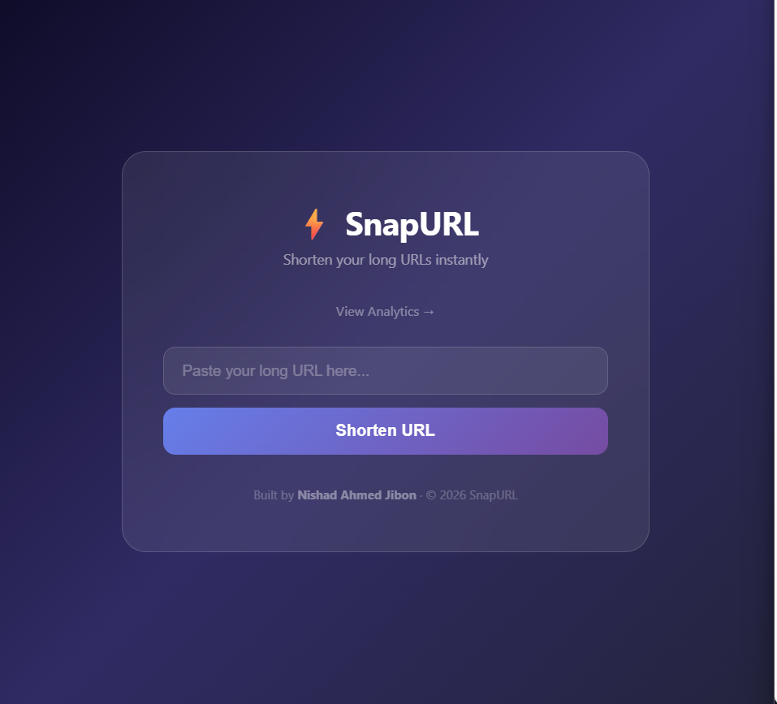
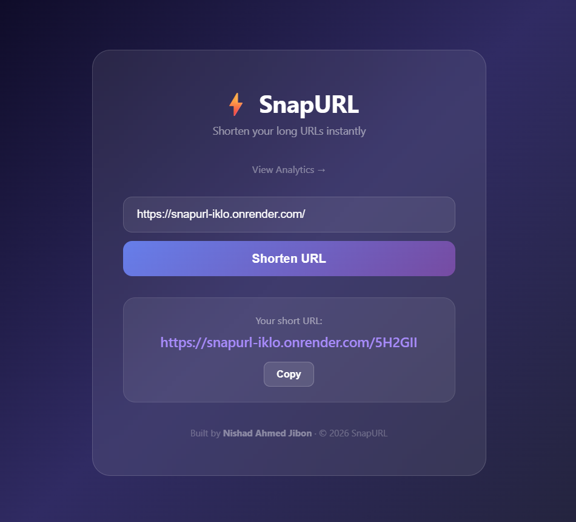

<div align="center">

# ⚡ SnapURL

### A fast, modern URL shortener with real-time analytics

[](https://snapurl-iklo.onrender.com)

[](https://github.com/nishadahmedjibon/SnapURL/actions)

[](https://hub.docker.com)



</div>

---

## About

SnapURL is a production-ready URL shortener built with a modern DevOps pipeline. It shortens long URLs instantly, tracks click analytics, and is deployed on the cloud with automated CI/CD.

This project was built to demonstrate real-world DevOps skills including containerization, cloud deployment, and automated pipelines.

---

## Features

- 🔗 **URL Shortening** — Instantly shorten any long URL
- 📊 **Click Analytics** — Track how many times each link was clicked
- ⚡ **Redis Caching** — 50x faster redirects using in-memory cache
- 📱 **Mobile Responsive** — Works on all screen sizes
- 🔄 **Auto CI/CD** — Auto deploys on every `git push`
- 🐳 **Fully Dockerized** — Runs anywhere with Docker

---

## Tech Stack

| Layer | Technology |
|---|---|
| Backend | FastAPI (Python) |
| Database | PostgreSQL |
| Cache | Redis |
| Frontend | HTML + CSS + JavaScript |
| Container | Docker + Docker Compose |
| CI/CD | GitHub Actions |
| Deployment | Render.com |

---

## Screenshots

### Home Page


### URL Shortened


### Analytics Page


---

## Run Locally

### Prerequisites
- Docker Desktop installed
- Git installed

### Steps

**1. Clone the repository:**
```bash
git clone https://github.com/nishadahmedjibon/SnapURL.git
cd SnapURL
```

**2. Create `.env` file:**
```env
APP_NAME=SnapURL
DEBUG=True
SECRET_KEY=your-secret-key
DATABASE_URL=postgresql://postgres:postgres123@db:5432/snapurl_db
REDIS_URL=redis://redis:6379
BASE_URL=http://localhost:8000
```

**3. Run with Docker:**
```bash
docker compose up --build
```

**4. Open in browser:**
```
http://localhost:8000
```

---

## API Endpoints

| Method | Endpoint | Description |
|---|---|---|
| POST | `/shorten` | Shorten a long URL |
| GET | `/{short_code}` | Redirect to original URL |
| GET | `/analytics/{short_code}` | Get click analytics |
| GET | `/health` | Health check |

### Example Request:
```bash
curl -X POST https://snapurl-iklo.onrender.com/shorten \
  -H "Content-Type: application/json" \
  -d '{"original_url": "https://www.google.com"}'
```

### Example Response:
```json
{
  "original_url": "https://www.google.com",
  "short_url": "https://snapurl-iklo.onrender.com/x7k2p",
  "short_code": "x7k2p"
}
```

---

## Project Structure
```
SnapURL/
├── app/
│   ├── __init__.py       # Package init
│   ├── database.py       # Database connection
│   ├── main.py           # FastAPI app setup
│   ├── models.py         # Database models
│   └── routes.py         # API routes
├── static/
│   ├── index.html        # Home page
│   └── analytics.html    # Analytics page
├── screenshots/          # Project screenshots
├── .github/
│   └── workflows/
│       └── deploy.yml    # GitHub Actions CI/CD
├── Dockerfile
├── docker-compose.yml
├── requirements.txt
└── .env.example
```

---

## CI/CD Pipeline

Every `git push` to `main` automatically:
```
Push to GitHub
      ↓
GitHub Actions triggered
      ↓
Build Docker image
      ↓
Push to Docker Hub
      ↓
Render auto-deploys
      ↓
Live site updated 🚀
```

---

## Author

**Nishad Ahmed Jibon**

- GitHub: [@nishadahmedjibon](https://github.com/nishadahmedjibon)
- LinkedIn: [nishad-ahmed-jibon-337b06236](https://www.linkedin.com/in/nishad-ahmed-jibon-337b06236/)
- Live Project: [snapurl-iklo.onrender.com](https://snapurl-iklo.onrender.com)

---

<div align="center">
Built with ❤️ as part of a DevOps learning journey
</div>
